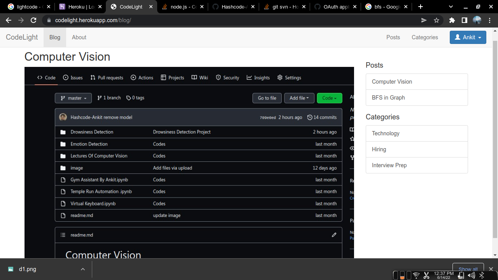

# CodeLight  : 
## Inovative Blogs and Exam preparation Portal for Coders

## Visit Web : https://codelight.herokuapp.com/

# File Structure :
 * #### blog-server.js file contain all the functions needed for the backed.
 * #### auth-services file contain information connecting to the mongo db 

# Features :
* Login 
* Register
* Post blog
* Relative Blogs
* Category add on

